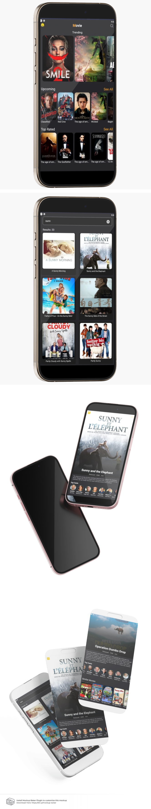

<!-- TABLE OF CONTENTS -->

# 📗 Table of Contents

- [📖 About the Project](#about-project)
  - [🛠 Built With](#built-with)
    - [Tech Stack](#tech-stack)
    - [Key Features](#key-features)
- [👥 Authors](#authors)
- [🤝 Contributing](#contributing)
- [⭐️ Show your support](#support)

<!-- PROJECT DESCRIPTION -->

# 📖 [Movie] 

### Movie : A movie app showcasing top-rated, upcoming, trending, and similar movies. Perfect for discovering your next favorite film 🎬✨

### It offers a sleek, user-friendly interface to explore movies effortlessly. 🎥

## 🛠 Built With 

- React Native Expo - Third-Party API - React Navigation - Axios - AsyncStorage

### Tech Stack 

  <ul>
    <li>React Native Expo</li>
    <li>Third-Party API</li>
    <li>React Navigation</li>
    <li>Axios</li>
    <li>AsyncStorage</li>
  </ul>

<!-- Features -->

### Key Features 

- **[Explore Top-Rated Movies]**
- **[Stay Updated with Upcoming Releases]**
- **[Discover Trending Movies]**
- **[Get Recommendations with Similar Movies Feature]**
- **[Enjoy a Sleek and User-Friendly Design]**
- **[Access Real-Time Movie Data]**

(<a href="#readme-top">back to top</a>)

<!-- AUTHORS -->

## 👥 Authors 

👤 **Hasnat khan**

- GitHub: [@hasnatali1947](https://github.com/hasnatali1947)
- Twitter: [@hasnatking1947](https://twitter.com/hasnatking1947)
- LinkedIn: [Hasnat ali](https://www.linkedin.com/in/hasnattali/)

(<a href="#readme-top">back to top</a>)

<!-- CONTRIBUTING -->

## 🤝 Contributing 

(<a href="#readme-top">back to top</a>)

<!-- SUPPORT -->

## ⭐️ Show your support 

If you like this project please leave a ⭐️

(<a href="#readme-top">back to top</a>)

